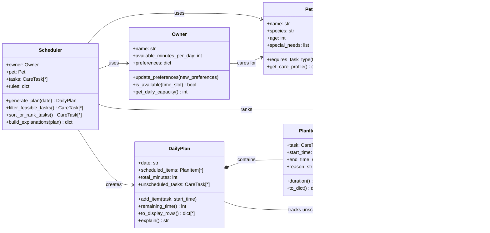

```mermaid
classDiagram
direction LR

class Owner {
  +name: str
  +available_minutes_per_day: int
  +preferences: dict
  +update_preferences(new_preferences)
  +is_available(time_slot) bool
  +get_daily_capacity() int
}

class Pet {
  +name: str
  +species: str
  +age: int
  +special_needs: list
  +requires_task_type(task_type) bool
  +get_care_profile() dict
}

class CareTask {
  +title: str
  +duration_minutes: int
  +priority: str
  +task_type: str
  +due_window: str
  +is_required: bool
  +priority_score() int
  +fits_in(remaining_minutes) bool
  +describe() str
}

class Scheduler {
  +owner: Owner
  +pet: Pet
  +tasks: CareTask[*]
  +rules: dict
  +generate_plan(date) DailyPlan
  +filter_feasible_tasks() CareTask[*]
  +sort_or_rank_tasks() CareTask[*]
  +build_explanations(plan) dict
}

class DailyPlan {
  +date: str
  +scheduled_items: PlanItem[*]
  +total_minutes: int
  +unscheduled_tasks: CareTask[*]
  +add_item(task, start_time)
  +remaining_time() int
  +to_display_rows() dict[*]
  +explain() str
}

class PlanItem {
  +task: CareTask
  +start_time: str
  +end_time: str
  +reason: str
  +duration() int
  +to_dict() dict
}

Scheduler --> Owner : uses
Scheduler --> Pet : uses
Scheduler --> CareTask : ranks
Scheduler --> DailyPlan : creates

DailyPlan *-- PlanItem : contains
PlanItem --> CareTask : references
DailyPlan --> CareTask : tracks unscheduled
Owner --> Pet : cares for
```